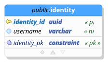

# sandbox-auth
Authentication Provider Service for Developer Sandbox

## Building

This project requires Podman to build. Refer to the [Podman](https://podman.io/getting-started) getting started guide for installation instructions.

Execute the `build.sh` script to build the Sandbox-Auth container. 

## Testing

Run the tests by executing `test.sh`. This project uses [Testcontainers for Golang](https://golang.testcontainers.org/) which 
allows it to spin up a Postgres database automatically for the purpose of integration tests.

## Schema

The database schema for this project may be found in the `doc/schema` directory.  It was created with `pgmodeler`, an open source database schema design tool.

Pgmodeler may be available in your Linux package repository and installable with a variation of the following command:

`dnf install pgmodeler`

After making changes to the schema, the new SQL file must be exported to the `migration/sql-files` directory, overwriting the existing `001-initial-schema.sql` file there.

A png image of the schema which is useful for reference may also be exported into the `doc/schema` directory and named `schema.png`.  Generating this image will also allow it to appear in this document as follows: 

